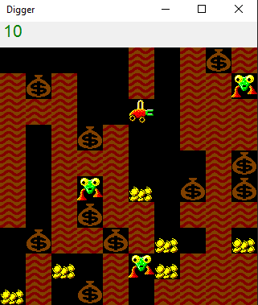

# Digger Game
Этот репозиторий содержит основные механики игры Digger, которая была разработана в 1983 году. Игра была создана на языке C# с использованием WinForms исключительно в учебных целях. Управление в игре осуществляется стрелками. В файле Game.cs можно создать свой уровень игры, написав подобный код:
"
PTTGTT TST
TST  TSTTM
TTT TTSTTT
T TSTS TTT
T TTTGMSTS
T TMT M TS
TSTSTTMTTT
S TTST  TG
 TGST MTTT
 T  TMTTTT",
где P - игрок, T - земля, G - золото, S - мешки, M - монстр, пробелы - пустое пространство.

# Скриншоты

